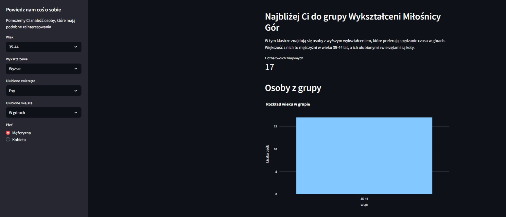
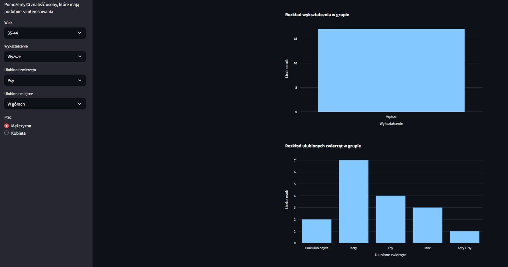
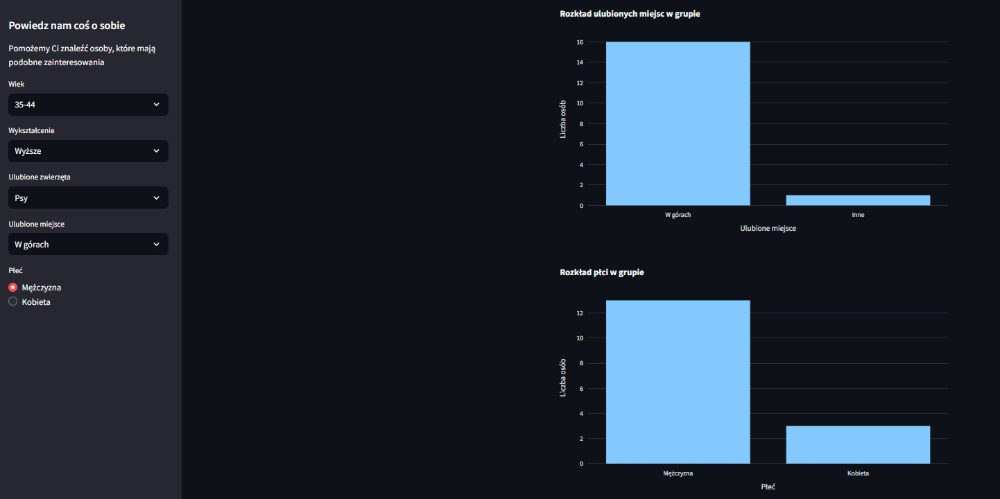

# Find Friends

* Data utworzenia: 2024-10-22   

* Opis projektu: 
Celem projektu było stworzenie aplikacji, która umożliwi wykorzystanie modelu klastrowania do przypisania użytkownika do odpowiedniej grupy w oparciu o zestaw danych. 

* Główne funkcjonalności: 

- Użytkownik filtruje podstawowe dane, takie jak: wiek, wykształcenie, płeć, ulubione zwierzęta czy ulubione miejsca - odpowiadające jego preferencjom
- Wytrenowany wcześniej model klastrowania tworzy odpowiednią liczbę klastrów dla danych z ankiety i dopasowuje preferencje użytkownika do pasującej grupy
- Dzięki użyciu modelu LLM, generowane są adekwatne opisy klastrów

* Trenowaniu modelu: Użyte narzędzia takie jak Scikit-learn, a cały proces jest zamieszczony w notatniku do pobrania: 
<a href="clustering_model_training.ipynb" class="md-button md-button--primary">Pobierz Notebook: Model training</a>

* Generowanie nazw klastrów: Użyłem modelu LLM, a implementację zamieściłem w notatniku do pobrania: 
<a href="clusters_naming.ipynb" class="md-button md-button--primary">Pobierz Notebook: Clusters naming</a>

* Umiejętności 
- Python 
- Langfuse 
- OpenAI 
- Streamlit 
- Scikit-learn 
- Plotly 
- PyCaret (Clustering), 
- NumPy 
- Matplotlib

Przykładowe zdjęcia: 
 
 
 
Aplikacja, wdrożona na platformie Streamlit Community App.

**Link to repozytorium:**https://github.com/Piotrek88/pracadomowam_7_1 