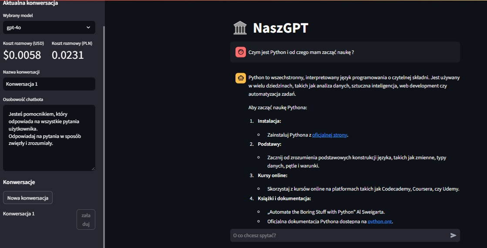
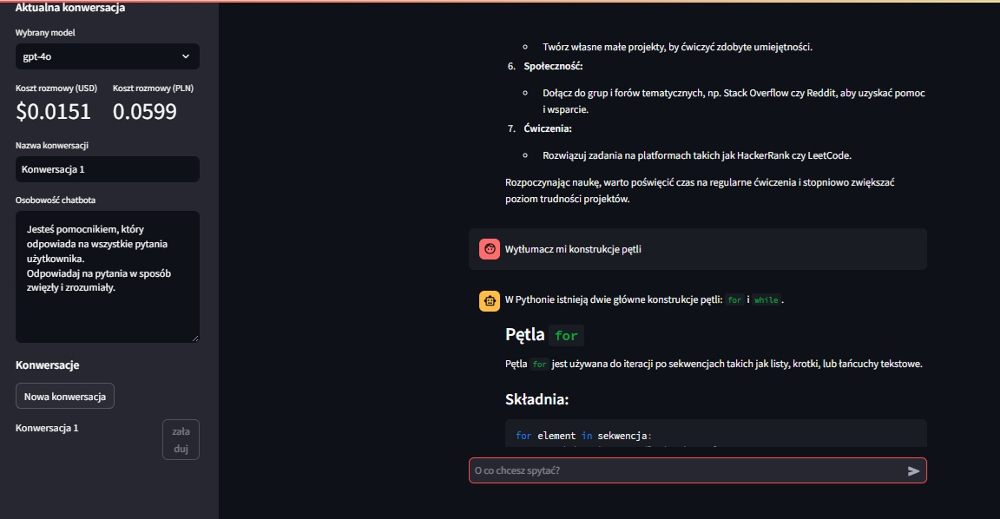

# Mój ChatBot

* Data utworzenia: 2024-12-19   

Opis projektu: 
Celem projektu było stworzenie własnej wersji Chat GPT, opartej na interfejsie aplikacji Streamlit. Chatbot może przyjąć dowolną osobowość, aby zmaksymalizować swoją funkcjonalność zgodnie z naszymi preferencjami.
  
Funkcjonalności aplikacji: 
- chatbot zapisuje rozmowy w strukturze pliku JSON, a Ty możesz łatwo przełączać się między rozmowami (bez utraty historii czatu) 
- możesz wybierać między różnymi modelami OpenAI (gpt-4o, gpt-4o-mini) 
- koszty korzystania ze sztucznej inteligencji naliczane i wyświetlane w czasie rzeczywistym 
- możesz dać chatbotowi indywidualną świadomość, która pokieruje typami odpowiedzi na zadawane pytania 

* Umiejętności: 
- Python 
- Langfuse 
- OpenAI 
- Streamlit 

**Przykładowe zdjęcia:** 

  
Aplikacja, wdrożona na platformie Streamlit Community App, umożliwia mi zgłębianie tajników sztucznej inteligencji i systematyczne doskonalenie umiejętności programistycznych.

**Link to repozytorium:**https://github.com/Piotrek88/naszgpt_langfuse 