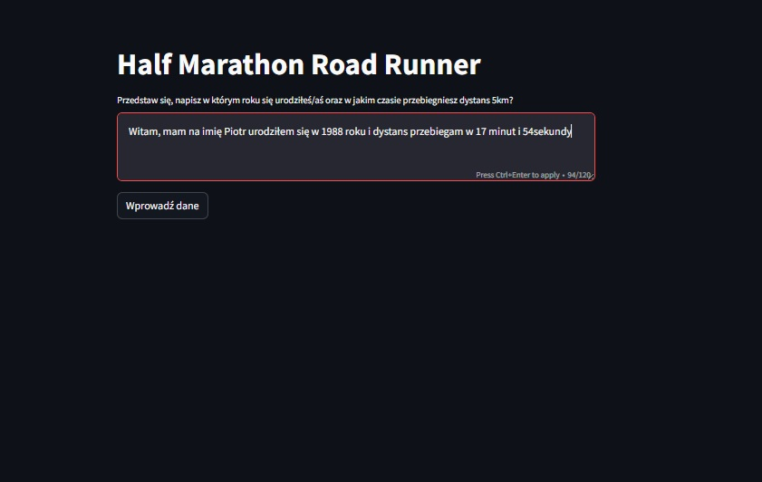
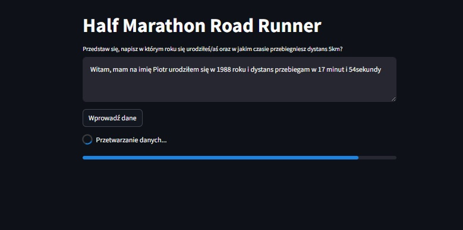
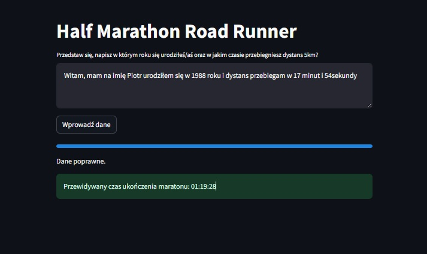

# Road Runner

* Data utworzenia: 2024-01-05   

Opis projektu: 
Celem projektu było stworzenie pipeline do trenowania modelu, oraz stworzenia aplikacji korzystającej z wytrenowanego modelu. 
Model trenowany był na danych z półmaratonu wrocławskiego i potrafi z krótkiego opowiadania o sobie stwierdzić w jakim czasie 
pokonamy półmaraton. 
  
Funkcjonalności aplikacji: 
- Aplikacja na podstawie naszego opisu wyciąga potrzebne informacje i przekazuje do modelu 
- Model na podstawie płci, wieku oraz średniego tempa biegu wskazuje nam
     informacje w jakim czasie powinniśmy pokonać półmaraton  
- Wytrenowany Model jest połączony z Langfuse w celu śledzenia cyklu życia modelu.
 

* Umiejętności: 
- Machine Learning 
- Python 
- Streamlit 
- Pandas 
- PyCaret 
- Instructor 
- Dotenv 
- OpenAI 
- Pydantic 
- Langfuse 

**Przykładowe zdjęcia:** 

  
Aplikacja, wdrożona na platformie Streamlit Community App.

**Link do repozytorium:** https://github.com/Piotrek88/RoadRunner 