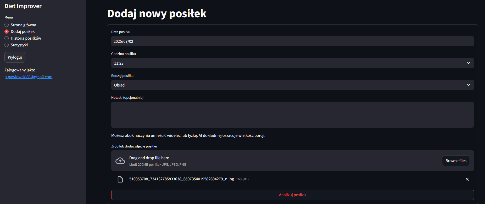
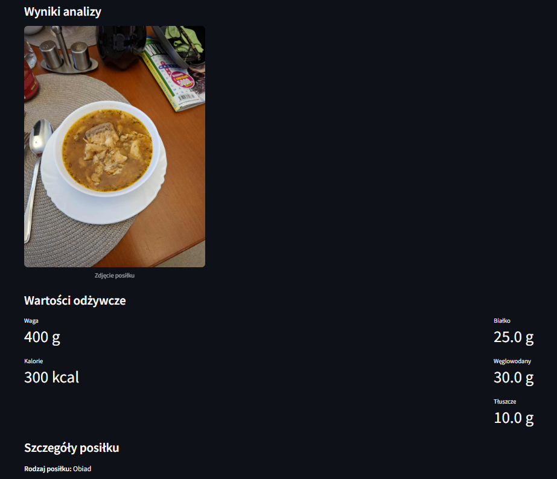
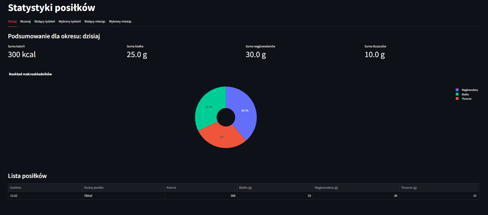

# diet-improver - Aplikacja do śledzenia i analizowania posiłków

* Data rozpoczęcia: 2024-03-18 
* Data ukończenia: 2024-05-06 

## Opis

Diet Improver to aplikacja webowa stworzona w Streamlit, która umożliwia użytkownikom:

- **Dodawanie zdjęć posiłków** - przesłanie zdjęć posiłków do analizy
- **Automatyczną analizę wartości odżywczych** - wykorzystanie modelu GPT-4o-mini do analizy składników
- **Śledzenie historii posiłków** - przeglądanie wszystkich dodanych posiłków
- **Przeglądanie statystyk i wykresów** - analiza spożytych posiłków w różnych okresach czasu

Umiejętnośći:   
 - Python 
 - psycopg2-binary 
 - OpenAI  
 - instructor 
 - Streamlit  
 - OpenAI  
 - PILL  
 - Pandas  
 - pypika  
 - bcrypt   
 - Pandas  
 - Plotly  
 - boto3  

## Przykładowe zrzuty ekranu

  

<a href="https://diet-improver-99ete.ondigitalocean.app/" class="md-button md-button--primary">Przejdź do aplikacji</a>
   
Rola w projekcie: Data Scientist / Python Backend Developer

