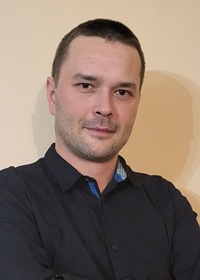

# Zapraszam do mojej przestrzeni inspiracji i twórczości! 
 
 

Witam! Nazywam się Piotr Pawłowski. Po 15 latach pracy jako kierowca ciężarówki odkryłem pasję do sztucznej inteligencji i pracy z danymi. Ukończyłem intensywne szkolenie "Od 0 do AI" i teraz, mimo braku wcześniejszego doświadczenia w programowaniu, tworzę aplikacje takie jak "Creative Paintings", generującą kolorowanki. Ponadto ukończyłem kilka projektów eksploracyjnej analizy danych (EDA). Aktualnie kontynuuję swoją edukację w ramach rozszerzonego kursu MasterClass, gdzie uczę się pracy zespołowej nad zaawansowanymi projektami. Nigdy nie przypuszczałem, że zostanę data scientist, ale ta dziedzina przynosi mi ogromną satysfakcję i radość. Czekam z niecierpliwością na kolejne wyzwania i projekty!

Jestem osobą która dąży do realizacji wyznaczonych celów, dającą z siebie maksimum zaangażowania. Zapraszam do współpracy!

## Kontakt
Piotr Pawłowski 
email: [p.pawlowski88@gmail.com](mailto:p.pawlowski88@gmail.com) 
tel: +48 666 833 321

---

## Wywiad: Moja droga z AI

Zobacz, jak opowiadałem o mojej drodzę z AI i rozwoju w branży w podcaście "AI w Biznesie". Od kierownicy do specjalisty – kliknij i poznaj szczegóły! 

<iframe width="560" height="315" src="https://www.youtube.com/embed/B2Y-TFaJj0Q" title="Wywiad AI w Biznesie" frameborder="0" allowfullscreen></iframe>

[Obejrzyj na YouTube](https://youtu.be/B2Y-TFaJj0Q) |  
Kluczowe fragmenty:  Moja droga (00:40-10:39) 
                    Projekt Creative Paintings (10:40-22:45) 
                    Zaangażowanie (36:26-44:18)