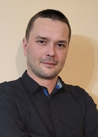

# Zapraszam do mojej przestrzeni inspiracji i twórczości! 
 
 

Witam! Nazywam się Piotr Pawłowski. Po 15 latach pracy jako kierowca ciężarówki odkryłem pasję do sztucznej inteligencji i pracy z danymi. Ukończyłem intensywne szkolenie "Od 0 do AI" i teraz, mimo braku wcześniejszego doświadczenia w programowaniu, tworzę zaawansowane aplikacje wykorzystujące najnowsze technologie AI.

## 🚀 Moja droga w Data Science

Od momentu rozpoczęcia mojej przygody z AI w 2024 roku, stworzyłem **10+ projektów** obejmujących:

### 🤖 **Aplikacje AI & Machine Learning**
- **NexSight** - Zaawansowana platforma analizy danych finansowych z predykcją trendów
- **Creative Paintings** - Generator kolorowanek wykorzystujący DALL-E 3
- **Mój ChatBot** - Własna implementacja ChatGPT z zarządzaniem konwersacjami

### 🏢 **Projekty korporacyjne**
- **ETL System** - Kompleksowy system ETL dla GOTOIT sp. z o.o. (Lider zespołu)
- **Diet Improver** - Aplikacja analizy żywienia z AI dla Imprv.ai sp. z.o.o.

### 📊 **Projekty Data Science**
- **Find Friends** - System klastrowania użytkowników z analizą preferencji
- **Road Runner** - Model predykcyjny czasu półmaratonu
- **Łowca Danych** - Interaktywna eksploracja danych z ankiety

### 📈 **Analizy Eksploracyjne (EDA)**
- **Projekt Praca** - Analiza archiwalnych danych z JustJoin.IT
- **Titanic** - Klasyczna analiza danych katastrofy
- **Iris** - Analiza zbioru danych kwiatów

## 🎯 **Kluczowe umiejętności**
- **Python** (Streamlit, FastAPI, Pandas, NumPy)
- **Machine Learning** (scikit-learn, PyCaret, TensorFlow)
- **AI & LLMs** (OpenAI API, Langfuse, Instructor)
- **Data Visualization** (Plotly, Matplotlib)
- **Web Development** (Streamlit, FastAPI, Uvicorn)
- **Database** (PostgreSQL, SQLAlchemy)
- **DevOps & Cloud** (Docker, Digital Ocean, Redis, Dramatiq)
- **Leadership** (Zarządzanie zespołem, Code Review, Project Management)

## 🌟 **Najnowsze osiągnięcia**
- **ETL System** - Lider zespołu w projekcie korporacyjnym dla GOTOIT sp. z o.o. (2025)
- **NexSight** - Kompleksowa platforma finansowa z predykcją trendów (2025)
- **Diet Improver** - Aplikacja analizy żywienia z AI dla Imprv.ai sp. z.o.o. (2025)
- Wystąpienie w podcaście "AI w Biznesie" o mojej drodze z AI

Jestem osobą która dąży do realizacji wyznaczonych celów, dającą z siebie maksimum zaangażowania. Każdy projekt to nowe wyzwanie i okazja do rozwoju. Zapraszam do współpracy!

## Kontakt
Piotr Pawłowski 
email: [p.pawlowski88@gmail.com](mailto:p.pawlowski88@gmail.com) 
tel: +48 666 833 321

---

## Wywiad: Moja droga z AI

Zobacz, jak opowiadałem o mojej drodze z AI i rozwoju w branży w podcaście "AI w Biznesie". Od kierownicy do specjalisty – kliknij i poznaj szczegóły! 

<iframe width="560" height="315" src="https://www.youtube.com/embed/B2Y-TFaJj0Q" title="Wywiad AI w Biznesie" frameborder="0" allowfullscreen></iframe>

[Obejrzyj na YouTube](https://youtu.be/B2Y-TFaJj0Q) |  
Kluczowe fragmenty:  Moja droga (00:40-10:39) 
                    Projekt Creative Paintings (10:40-22:45) 
                    Zaangażowanie (36:26-44:18)