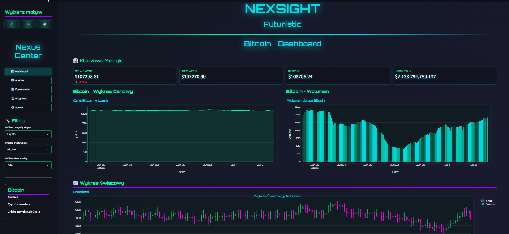
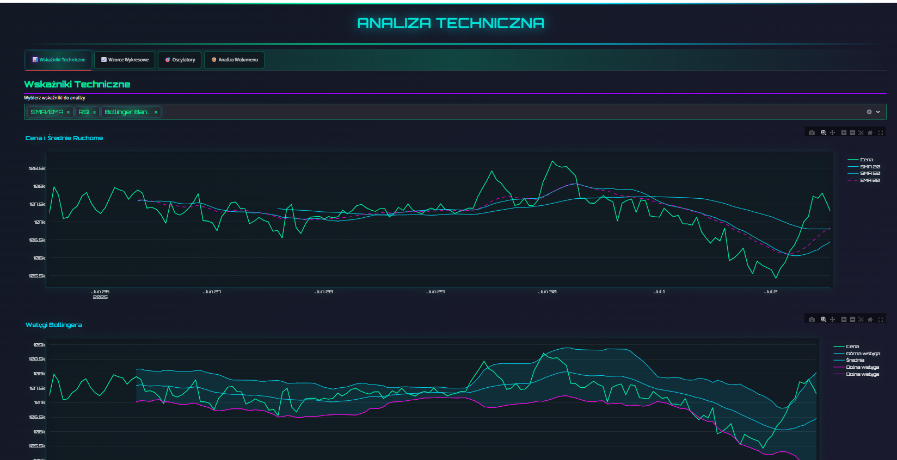
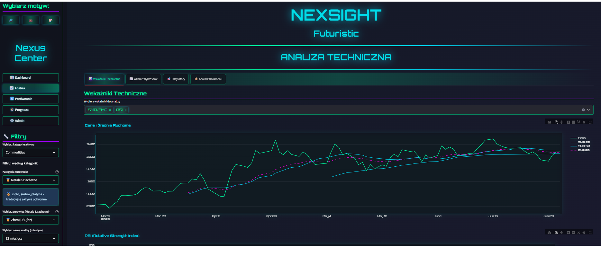
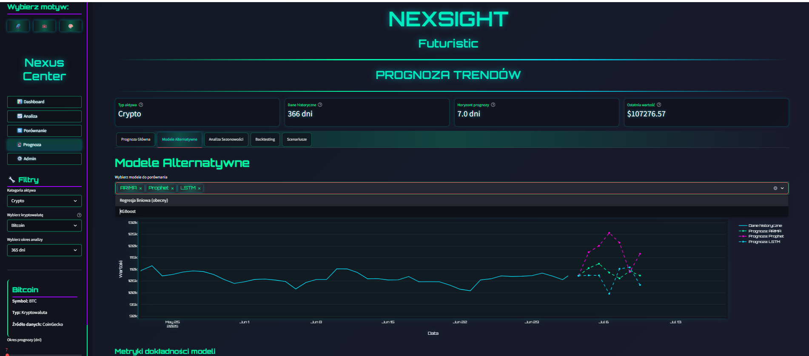

# NexSight - Finansowa Platforma Analizy Danych

* Data rozpoczęcia: 2025-06-18 
  

## Opis

NexSight to zaawansowana aplikacja webowa do analizy danych finansowych, która umożliwia użytkownikom:

- **📈 Dashboard w czasie rzeczywistym** – kryptowaluty, surowce, inflacja
- **🔬 Analizę techniczną** – pełny zestaw wskaźników (RSI, MACD, Bollinger Bands)
- **🔮 Predykcję trendów** – modele GARCH, VAR, LSTM, XGBoost
- **📊 Analizę korelacji** – porównania między aktywami
- **🎨 3 motywy UI** – Futuristic, Corporate, Vibrant
- **🔌 API REST** – pełne API do integracji z zewnętrznymi systemami

Umiejętności:   
- Python 
- Streamlit 
- FastAPI 
- Uvicorn 
- Pandas 
- NumPy 
- SQLAlchemy 
- psycopg2 
- Plotly 
- Matplotlib 
- ta (Technical Analysis) 
- scikit-learn 
- Prophet 
- arch (GARCH models) 
- statsmodels 
- TensorFlow 
- Keras 
- XGBoost 
- SciPy 
- schedule 
- streamlit-aggrid 
- requests 
- python-dotenv 
- python-decouple 
- yfinance 
- beautifulsoup4 
- mplfinance 

## Przykładowe zrzuty ekranu

  

Rola w projekcie: Data Scientist / Python Backend Developer / AI & MLOps

